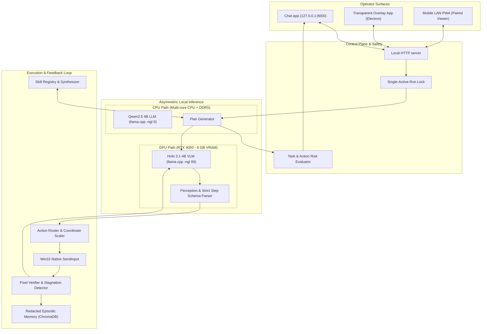

<div align="center">

# OmniVLA

### Vision-Language-Action Desktop Agent for Consumer Hardware

[](https://www.python.org/)
[](https://microsoft.com)
[](https://developer.nvidia.com/cuda-toolkit)
[](https://pytest.org)
[](https://github.com/ggerganov/llama.cpp)
[](LICENSE)

<p align="center">
  <b>OmniVLA</b> is an open, vision-first Windows desktop agent designed to run on an RTX 4050 laptop GPU with 6 GB VRAM.
</p>

[Key Features](#-key-features) • [Architecture](#-architecture) • [Hardware Profile](#-reference-hardware-profile) • [Quick Start](#-quick-start) • [UI & Workspaces](#-operator-command-center) • [Skills & Teaching](#-skills--demonstration-recorder) • [Safety & Security](#-safety--security-model) • [Documentation](#-documentation)

---

</div>

## 🌟 Overview

Unlike blind coordinate macro runners or expensive cloud-tethered generalist agents, **OmniVLA** pairs real-time visual perception with structured reasoning on local hardware:

- **Asymmetric Hardware Topology**: A dedicated vision-action model executes on the 6 GB CUDA GPU while the planner runs on CPU and system RAM. The two models never compete for VRAM.
- **Evidence-Grounded Execution**: Every mouse click, drag, keystroke, and app switch is derived from a fresh desktop screenshot and validated against a typed action schema.
- **Review by Design**: A plan is reviewed before execution, visual changes are verified after actions, and high-consequence controls require confirmation.
- **Extensible Procedural Skills**: Capture complex workflows via native demonstration recording with automatic credential redaction, compile them into Markdown skills, and execute with visual grounding.

---

## 🏛️ Architecture

OmniVLA decouples visual perception from high-level planning and risk analysis:



---

## ⚡ Key Features

| Feature | Description |
| :--- | :--- |
| 👁️ **Visual Desktop Grounding** | Full multi-monitor coordinate normalization, pure screenshot perception, and strict Pydantic `Step` schema validation. |
| 🖱️ **Native Win32 Input** | Direct `SendInput` execution supporting clicks, double clicks, right clicks, drag & drop, typing, hotkeys, scroll, and window management. |
| 🛡️ **Fail-Closed Safety Engine** | Validates bounding boxes, durations, and dangerous UI targets (financial, deletion, external access) with just-in-time confirmation. |
| 🔄 **Visual Verification** | Compares before/after frames, blocks repeated failed actions, and reports stagnation without another model call. |
| 🎓 **Native Demonstration Teaching** | Records low-level user demonstrations with background thread processing and masks sensitive credentials into `{{typed_value}}`. |
| 💬 **Chat-first UI** | Separate conversations, a per-chat execution panel, Skills, and Settings in a responsive desktop shell. |
| 📱 **Paired Mobile PWA** | Low-latency LAN operator companion with constant-time token verification and desktop-isolated permissions. |
| 🔒 **Privacy-First Memory** | Opt-in episodic recall with automatic PII/secret scrubbing and desktop-only memory purge controls. |

---

## 💻 Reference Hardware Profile

| Subsystem | Specification |
| :--- | :--- |
| **Operating System** | Windows 10 or Windows 11 (x64) |
| **GPU** | NVIDIA GeForce RTX 4050 Laptop GPU (6 GB VRAM) or equivalent CUDA GPU |
| **CPU & RAM** | Modern multi-core CPU (AMD Ryzen 5/7/9 or Intel Core i5/i7/i9) with 16 GB+ DDR5 RAM |
| **Visual Executor** | `Holo-3.1-4B-abliterated-rdo.Q4_K_M.gguf` + `Holo-3.1-4B.mmproj-f16.gguf` (GPU offload `-ngl 99`) |
| **Planner** | `Qwen3.5-4B.Q4_K_M.gguf` (CPU execution `-ngl 0`) |
| **Runtime Dependencies** | Python 3.10+, `llama-server.exe` under `llama-cpp/` |

---

## 🚀 Quick Start

### 1. Prerequisites & Installation

Clone the repository and install the Python dependencies:

```powershell
# Clone the repository
git clone https://github.com/abdullah-153/OmniVLA.git
cd OmniVLA

# Create and activate virtual environment
python -m venv venv
.\venv\Scripts\Activate.ps1

# Install requirements
pip install -r requirements.txt
```

### 2. Model & Runtime Setup

1. Download the quantized model weights and place them in the `models/` folder:
   - **Holo 3.1 4B VLM**: `models/Holo-3.1-4B-abliterated-rdo.Q4_K_M.gguf`
   - **Holo Multimodal Projector**: `models/Holo-3.1-4B.mmproj-f16.gguf`
   - **Qwen3.5 4B Planner**: `models/Qwen3.5-4B.Q4_K_M.gguf`
2. Ensure `llama-server.exe` with CUDA support is located in `llama-cpp/`.

### 3. Launching OmniVLA

Start the local app and model harness:

```powershell
python run_agent_gui.py
```

Open **`http://127.0.0.1:8000`** if the desktop shell does not open automatically.

*(Optional)* Launch the Electron desktop shell:
```powershell
cd console-app
npm install
npm start
```

---

## 🖥️ Desktop app

The interface is organized around conversations:

1. **Chats**: Start a new chat, search saved chats, and review the plan and final response without mixing other runs into the thread.
2. **Execution**: Each chat owns its action history, latest screen, timing state, approvals, Pause, and Stop controls in a dedicated side panel.
3. **Skills**: Search the library, import `.md`, `.markdown`, or `.mds`, edit Markdown, or teach a workflow by demonstration.
4. **Settings**: Configure plan approval, action limits, local recall, recording, and model restart controls without exposing model topology in normal use.

---

## 🛠️ Skills & Demonstration Recorder

OmniVLA allows users to define and teach complex procedural workflows:

- **Markdown Skill Definitions**: Skills are structured Markdown files with parameters, pre-conditions, step strategies, and visual grounding guidelines (located in `skills/`).
- **Low-Level Native Recorder**: Start a demonstration to capture clicks, shortcuts, application changes, and redacted typing via Windows hooks without recording agent feedback loops.
- **Privacy Masking**: User typing is automatically converted into parameterized tokens (`{{typed_value}}`) to prevent credential leakage.
- **Skill Synthesizer**: Converts raw recorded demonstrations into reusable, parameterized skills.

---

## 🧪 Testing & Verification

OmniVLA includes a hermetic test suite covering model command construction, coordinate scaling, Win32 input, risk grounding, control-plane authorization, and UI contracts:

```powershell
# Run the full test suite (100+ tests)
python -m pytest -q

# Run end-to-end integration test harness
python run_e2e_tests.py

# Check runtime readiness & hardware profile
python benchmark_runtime.py --json

# Evaluate historical run performance metrics
python evaluate_runs.py --json
```

---

## 🛡️ Safety & Security Model

- **Fail-Closed Policy**: Malformed or ungrounded model outputs fail closed without triggering phantom inputs.
- **Consequential Action Interception**: Actions targeting delete buttons, money transfers, password fields, or system settings require explicit operator confirmation.
- **Desktop Isolation**: Destructive commands, skill modifications, teaching sessions, and memory deletions can only be invoked from local loopback (`127.0.0.1`).
- **Privacy by Default**: All sensitive tokens and keys remain strictly in-process memory and are never persisted or echoed in status responses.

---

## 📂 Repository Structure

```
OmniVLA/
├── cogniagent/                  # Core Agent Architecture
│   ├── agent.py                 # Main Agent Execution Loop & State Machine
│   ├── config.py                # System Configurations & Model Settings
│   ├── execution/               # Action Router & Win32 Native Input
│   ├── gui/                     # Web Server, Control Plane, Static Web UI
│   │   ├── control_plane.py     # Request Validation & Security Boundary
│   │   ├── server.py            # FastAPI Server Endpoints
│   │   ├── server_manager.py    # llama.cpp Subprocess Manager
│   │   └── web/                 # Chat-first web interface
│   ├── memory/                  # Vector Memory (ChromaDB) & Redaction
│   ├── perception/              # VLM Engine, Screen Capture, Verification
│   ├── reasoning/               # Action Reasoner & Strategy Formulation
│   └── skills/                  # Skill Registry, Compiler & Synthesizer
├── console-app/                 # Electron Desktop Application Shell
├── documentation/               # Research, Architecture Audits & Benchmarks
│   ├── 09_Command_Center_Research_and_Design.md
│   ├── 10_Local_Performance_Profile.md
│   ├── 11_Repository_Architecture_and_Security_Audit.md
│   ├── 12_2026_Model_Agent_and_Benchmark_Landscape.md
│   └── 13_Background_Execution.md
├── overlay-app/                 # Transparent Execution Overlay Interface
├── skills/                      # Built-in Procedural Skill Library
├── tests/                       # Complete Pytest Hermetic Test Suite
├── benchmark_runtime.py         # Hardware Readiness & VRAM Profiling
├── evaluate_runs.py             # Performance & Metric Aggregation Script
├── run_agent_gui.py             # Main Entrypoint Script
├── run_e2e_tests.py             # End-to-End Verification Pipeline
├── PROJECT.md                   # Technical Architecture & Trust Boundaries
├── PRODUCT.md                   # Product Positioning & Requirements
└── DESIGN.md                    # Visual Style Guide & Design System
```

---

## 📚 Documentation

For in-depth architectural and research details, consult the following references:

- [`PROJECT.md`](PROJECT.md) — Implementation architecture, execution lifecycle, and trust boundaries.
- [`PRODUCT.md`](PRODUCT.md) — Product requirements, positioning, and target user profile.
- [`DESIGN.md`](DESIGN.md) — Visual design tokens, layout hierarchy, and interaction design.
- [`documentation/10_Local_Performance_Profile.md`](documentation/10_Local_Performance_Profile.md) — 6 GB VRAM local profiling protocol.
- [`documentation/11_Repository_Architecture_and_Security_Audit.md`](documentation/11_Repository_Architecture_and_Security_Audit.md) — Security audit and control-plane boundary specifications.
- [`documentation/12_2026_Model_Agent_and_Benchmark_Landscape.md`](documentation/12_2026_Model_Agent_and_Benchmark_Landscape.md) — Comparative benchmark analysis and future model roadmap.
- [`documentation/13_Background_Execution.md`](documentation/13_Background_Execution.md) — Hybrid background, semantic, and isolated execution architecture.

---

## 📄 License

This project is licensed under the [MIT License](LICENSE).

---

<div align="center">
  <sub>Built with ❤️ for local, privacy-respecting, vision-first computer use automation.</sub>
</div>
